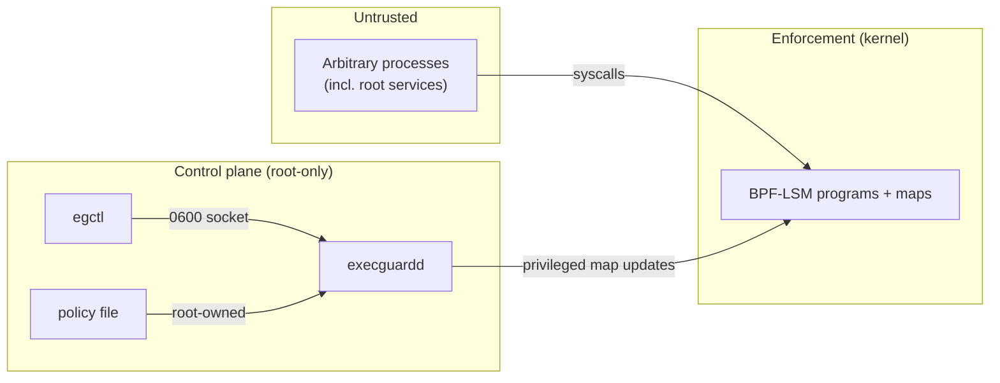

# Security model

## Reference monitor properties

A reference monitor must be (1) always invoked, (2) tamper-resistant, and
(3) small enough to verify. ExecGuard's enforcement core is evaluated against
these three classic criteria.

### Always invoked (complete mediation)

Enforcement lives on LSM hooks in the syscall path. Every `open`, `unlink`,
`rename`, and `setattr` that reaches the VFS passes through the corresponding
hook regardless of which process issued it or how (shell, editor, interpreter,
static binary). There is no "side door" syscall that mutates a regular file's
contents without traversing these paths. This gives complete mediation for the
operations in scope.

The deliberate exception is the identity binding: the set of protected inodes is
fixed at policy-load time. Complete mediation applies to operations on
*already-protected* inodes; a newly created file at a previously protected path
is not mediated until reload. See [limitations.md](limitations.md).

### Tamper-resistant

The enforcement code runs in the kernel, not in a userspace process an attacker
can `ptrace` or kill to disable checks. The BPF verifier guarantees memory
safety of the loaded programs. The control socket is root-owned and mode `0600`,
so only root can issue control commands.

The honest limit: the mechanism is only as tamper-resistant as root allows.
Root can detach the programs. Full tamper resistance against root requires the
external controls in [threat-model.md](threat-model.md).

### Small and verifiable

The entire enforcement core is one BPF source file of a few hundred lines with a
single decision function. The policy that the kernel evaluates is reduced to
map membership tests. This is intentionally minimal so the security-relevant
logic is easy to read and reason about.

## Trust boundaries

- Any process may *attempt* operations; the kernel adjudicates them.
- Only root may configure policy (edit the file, drive `egctl`, update maps).
- The policy file and control socket are the configuration trust boundary; both
  are root-owned.

## Decision precedence

For an operation on a protected inode, the checks are evaluated in a fixed order,
and the first match wins:

1. **Trusted updater** (caller's executable inode is in `trusted_exes`) - allow.
2. **Maintenance window** active - allow.
3. **Global audit-only mode** - allow, but log as a would-deny.
4. Otherwise - deny with `-EPERM`.

Every one of these outcomes emits an audit event, so both denials and
authorized changes are recorded. Operations on unprotected inodes return before
any of this and are not logged, keeping the audit trail signal-rich.

## Privilege separation

The daemon needs privilege only to load BPF, attach LSM programs, and update
maps (`CAP_BPF`, `CAP_SYS_ADMIN`, `CAP_PERFMON`). It does not need to open or
write the files it protects. The trusted-updater grant is scoped to a specific
executable inode rather than a user or a path, which is the narrowest identity
the kernel can cheaply check for the acting process.
